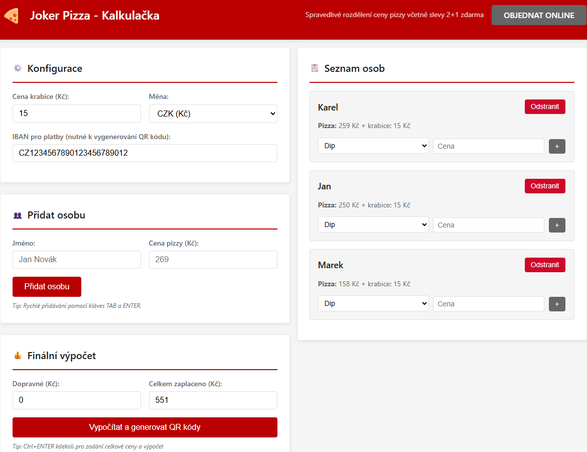
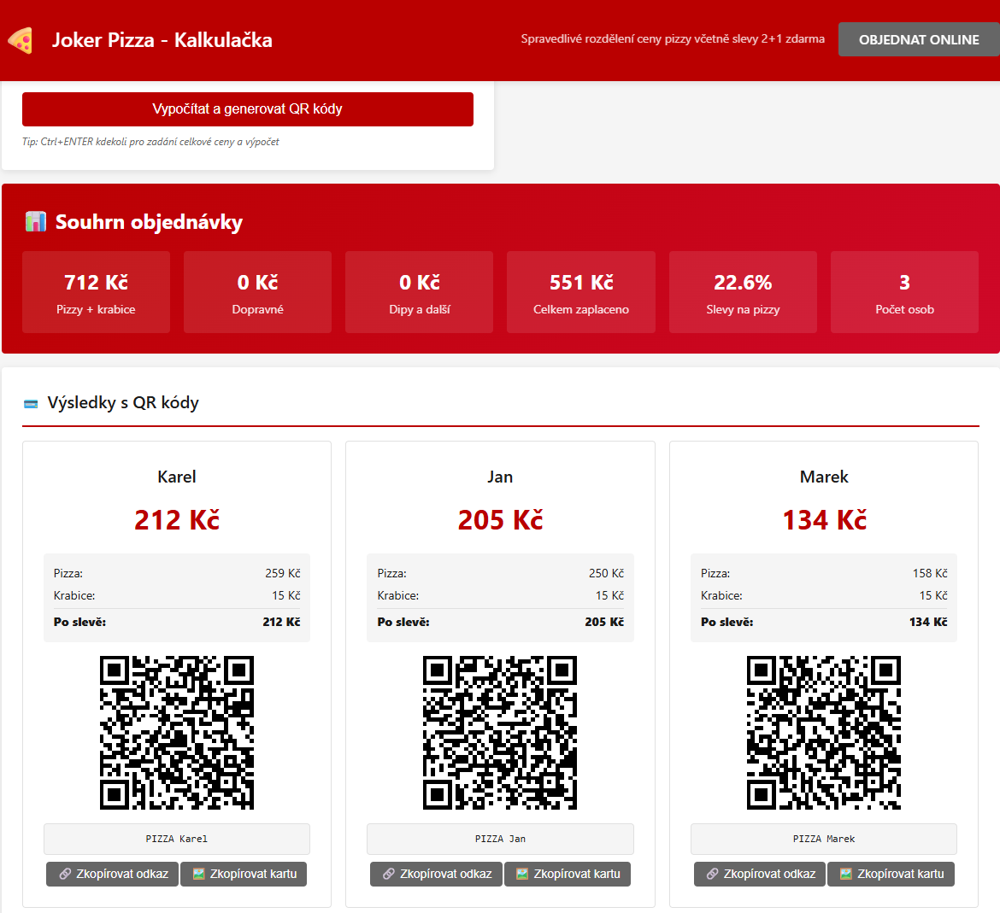
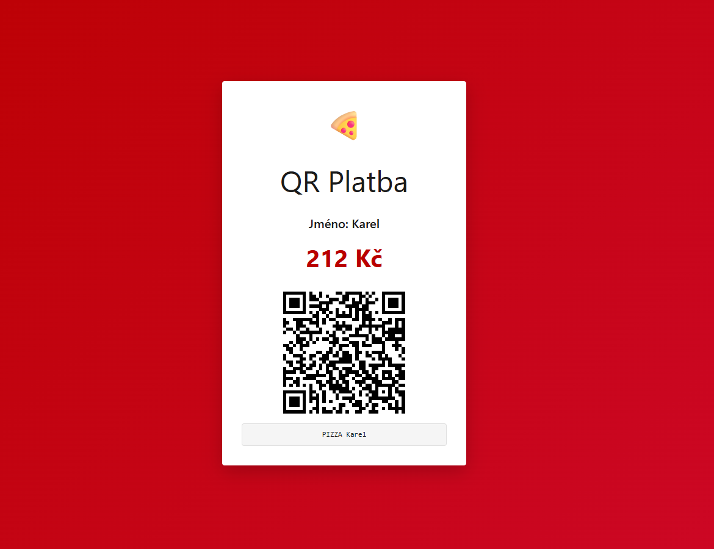

# 🍕 Joker Pizza Kalkulačka

**Jednoduchá webová aplikace pro férové rozpočítání společné útraty za pizzu – s QR kódy a podporou slev 2+1 zdarma.**  
Užitečné nejen pro pizzu, ale i pro cokoliv, kde se skládá více lidí.

---

## 🧩 K čemu to je?

Tato aplikace vznikla pro **pobočku Joker Pizza**, kde se často skládáme na společnou objednávku. Cílem je:

- rozpočítat útratu spravedlivě (včetně rozpočtení dopravy a slev),
- vygenerovat **QR kódy** pro rychlou platbu,
- poskytnout každému osobní platební údaje i odkaz na vlastní QR kód.

Výpočet zohledňuje:

- cenu pizzy,
- fixní cenu krabice,
- dopravu,
- individuální doplňky (dip, nápoj, dezert...),
- a celkovou zaplacenou částku se slevou.

---

## 🎯 Hlavní vlastnosti

- **Offline HTML stránka** – vše v jednom souboru.
- **Žádné závislosti na serveru** – běží lokálně v prohlížeči.
- **QR platby (SPAYD formát)** – pro každý výsledek se generuje platný QR kód.
- **Zkopírovatelný odkaz nebo obrázek karty** – ideální pro sdílení na chatu.
- **Přístupné ovládání pomocí klávesnice** – není třeba používat myš.
- **Přehledný souhrn + výsledkové karty** – každá karta je přehledně rozpadlá.
- **Přehledný tisk** - celou stránku lze vytisknout třeba do PDF pro celkového souhrnu objednávky.

---

## ⌨️ Ovládání bez myši

Aplikace je optimalizovaná pro **rychlé vyplnění pomocí klávesnice**:

- Po načtení stránky se rovnou označí vstupní pole a lze zadávat
- **Tab** – přechod mezi poli.
- **Enter** – přidávání více osob a cen za pizzu.
- **Ctrl + Enter** – zadání zaplacené částky a generování QR kódů.

---

## 🛠️ Použití

1. Otevři `index.html` v libovolném moderním prohlížeči.
2. Pro generování QR kódů zadej číslo účtu ve formátu IBAN
3. Vyplň jména, ceny pizz a případné doplňky.
4. Zadej dopravu a celkovou částku zaplacenou u pizzerie.
5. Klikni na **„Vypočítat a generovat QR kódy“** nebo stiskni `Ctrl + Enter`.
6. Vygenerují se osobní částky a QR platby.

---

## 🏷️ Určeno pro Joker Pizza – ale použitelné univerzálně

Aplikace vznikla pro **konkrétní potřebu Joker Pizza**, ale:

- lze ji použít i pro jakékoliv jiné objednávky, rozpočty nebo sdílené výdaje,
- je snadno upravitelná – vše je v jednom přehledném HTML souboru.

---

## 🚧 Plány do budoucna

V blízké době vydám:

- obecnější verzi s konfigurovatelným logem a barvami,
- možnost ukládání dat do LocalStorage nebo URL hash,
- podporu pro více měn a jazyků.

---

## 📷 Ukázka

---

## 🔓 Licence

MIT – Používej, upravuj, sdílej. Budu rád, když zanecháš kredit nebo mě oslovíš s vylepšeními.

